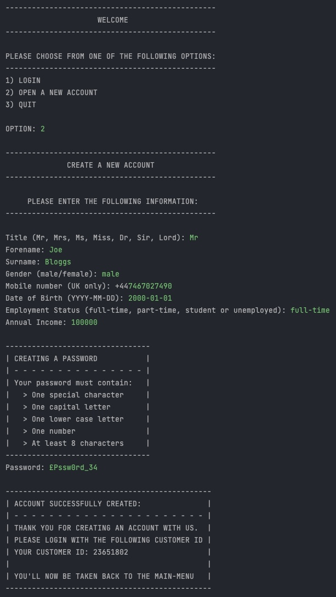
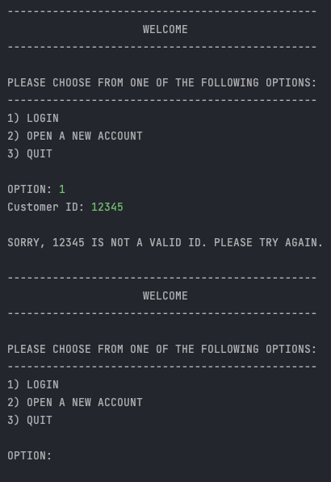
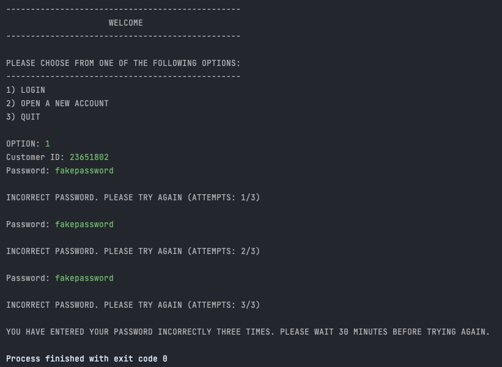
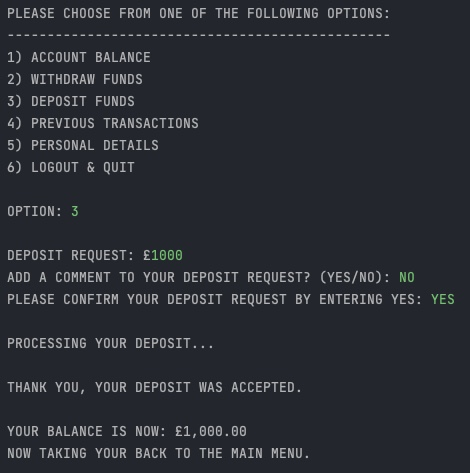
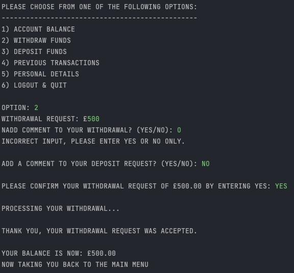
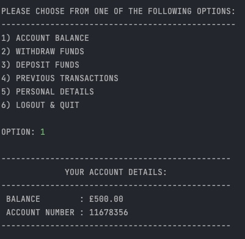
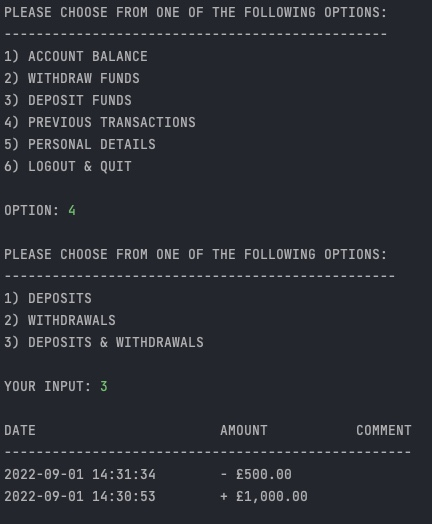
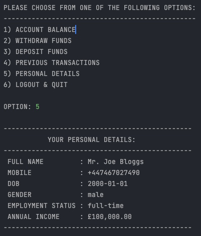

## Java Banking System

Simple and robust banking system built in java utilising test-driven development and a MySQL database. 

**Functionality includes:**
1. New account creation.
2. Login user authentication.
3. Withdrawals.
4. Deposits.
5. Display of personal, account and transaction information through SQL database queries.

Please note the program will not run as the database variables have been set to null before pushing to Github. To run it, please create a MySQL database and change the url, username and password variables in src/Database.java. 

### Example Screenshots

**Creating an account:**

**Login in authentication:**

ID does not exist: 

ID exists but incorrect password entered:

**Deposit funds:**

**Withdraw funds:**

**Check balance:**

**Previous transactions:**

**Personal information:**

